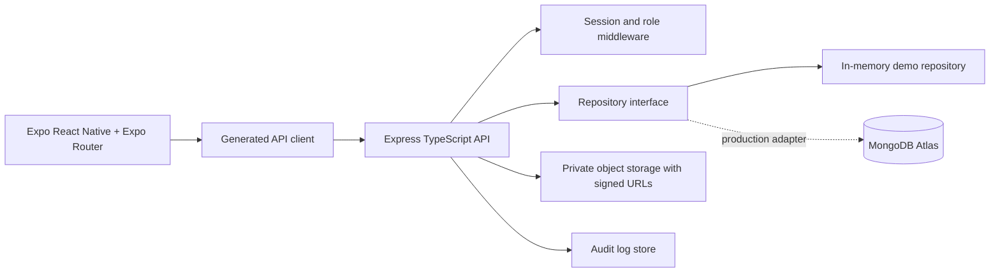

# Drug Lense architecture

The mobile app keeps local UI state in a React context, server-shaped types in shared OpenAPI-generated packages, and session material in SecureStore. The API is the trust boundary: it validates input, authenticates the request, scopes records to the user's organization, applies role permissions, and creates audit events.

Image analysis is isolated behind `ImageAnalysisService`-shaped logic. The first build uses deterministic demo assessment only; a future on-device model must preserve explainability and the inconclusive path.